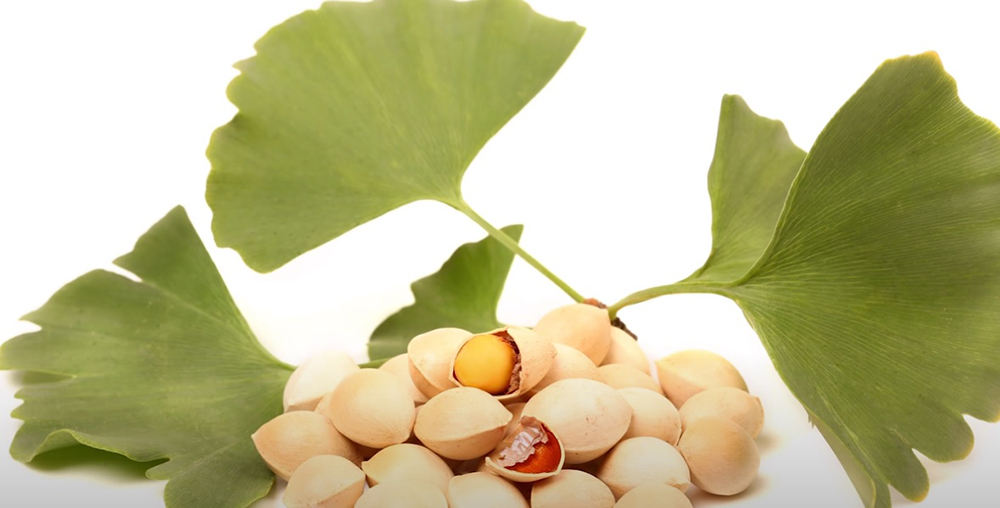

Herbs are the natural alternative to energy supplements with no health side-effects at all. Today, we have busy schedule. We can’t manage to stop and take proper rest at work. Most of us have either work pressure or study pressure or peer pressure.

Sometimes, unknowingly we even feel tired and expose our mental and physical fatigue to the world; this all happens due to the low energy in our body and sometimes due to some disease, the other reason could be your energy intake is lower than the energy consumption at work due to heavy mental and physical work that you perform.

Irrespective of such miner health condition you would never want to skip your work. But we live in a World where companies observe and watch us and these companies create supplement product and advertise them on TV, Radio and on the web and a lot of people realize it and buy these energy supplements from these smart companies. But these energy supplements do not help everybody and may also have some severe or miner health side-effects.

That’s the reason why more and more people are becoming vegan and visiting herbalists these days. But hey! You do not need to visit an herbalist because I have chosen best herbs to boost energy and keep you energized throughout the day. Here is a list of herbs that have been in use for centuries to boost energy and keep people energized.

## Green Tea      

Green tea is extracted from Camellia sinensis and these leaves are used with oxidation process, unlike black tea which undergoes oxidation before we use them. Green tea contains a specific chemical called as catechins which has many health benefits. One of the biggest benefits the consumption of green tea has it enhances activities of brain specifically the dorsolateral prefrontal cortex and hence improves the memory of a person.

Green tea also contains caffeine that works as a mild stimulant. Thus, it increases the oxygen supply to the brain and allow it to work more efficiently. Green tea also has anti-oxidation effect and hence anti-carcinogenic. These days when different types of cancers are rampant, green tea is advised to consume regularly. Polyphenols in the green tea also imparts anti-biotic effect. Therefore, green tea is full of health benefits and it keeps you energetic to work the whole day.

## Ginkgo Biloba

This is a natural extract derived from the leaf of ginkgo tree which is a Chinese tree. For decades, this tree has been studied by many countries and they are well placed in Traditional Chinese Medicine. Studies has confirmed that ginkgo enhances the production of ATP, the principal chemical that is involved in providing ATP. This ATP reaches all the cells and you feel energetic.

This herb can be taken in many forms like capsule or liquid extract. Ginkgo also helps in maintaining the blood vessel integrity and blood flow which increases good supply of blood and nutrition to the cells, ensuring the increased activities of the cells.

## Ashwagandha Root

Withania somnifera is the familiar name in Ayurvedic medicine which is used to ease fatigue and exhaustion. It is available in powder form in the market. You can easily buy them and consume them. They are famous as adaptogen, that means, it helps to adapt to stress (either it can be physical or mental) and helps to maintain physioloigical balance of the body (or homeostasis).

This ayurvedic medicine is also helping in making immune system strong. Ashwagandha can restore normal hormone level (specially cortisol hormone) leading to prevention of fatigue and boosting the energy throughout the day. Even in one scientific study, Ashwagandha was found to produce calming effect among rat population which is equal to the calming effect produced by Lorazepam (an anti-anxiety medicine for human).
 
The mental calmness and hormonal balance produced by Ashwagandha medicine aids in boosting your energy. You can browse this herb on online platform as you can get many products of Ashwagandha.

## Basil

Basil is one of the divine herbs. It is quite prevalent medicine in Ayurvedic system for treating cold and cough. Since earlier times, it has been used in decreasing pain and swelling. It is quite established that basil lowers stress hormone and thus energizes the body from within.

It also boosts immunity and hence it prevents infections and weakness. In fact, drinking water with some basil leaves in it gives you a cool and calm feelings inside your body. Basil has long term positive effect on cardiovascular system. As the cardiovascular system works well, the blood supply and hence oxygenation increases. When the most of the cells get sufficient oxygen, then, there is less fatigue or tiredness.

