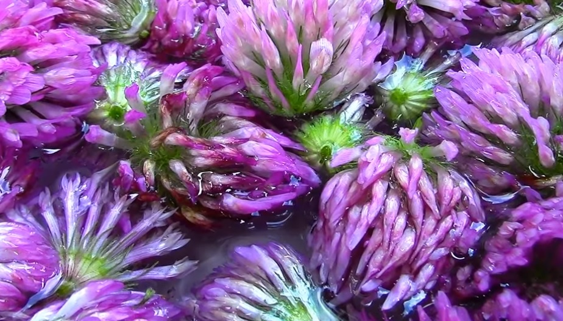
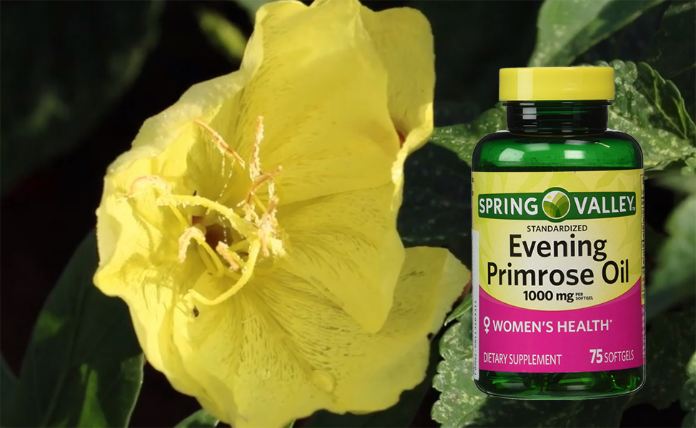
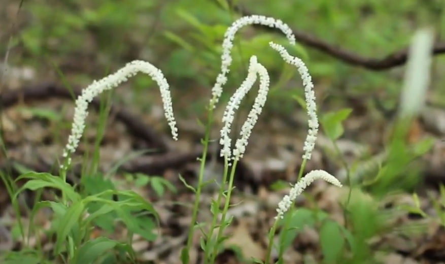

Herbs are our first medicine, also called home remedies, herbs offer numerous health benefits and they are nontoxic, in other words – herbs have almost no side-effects. Herbs are used to treat various health problems. Herbal medicines and supplements have the potential to enhance fertility by supporting the natural functioning of the ovulation and fertility process. They act as supplement to a healthy diet and help boost your body’s regular functions, reproductive system and fertility. 

So, whenever you are looking forward to get pregnant, herbs are the way to go because they are all-natural with no side-effect, whatsoever. Though there is no conclusive evidence to prove that herbs enhance fertility, however, they have been used in many cultures for centuries to support reproductive health and fertility. Since the primary purpose of herbal medicines used to improve ovarian function, individuals taking birth control pills need to stay away from them.

**Here is the list of best herbs for fertility**

## Red clover for Fertility

It is called as estrogen twin hormonally. They are not identical but serve the same purpose of thickening the uterine lining, which leads to better implantation and increases your fertility. The usage of red clover is contradicted in pregnancy and breastfeeding.

So, once you become pregnant, you should not drink it. Its usage is also not recommended in some other conditions like breast cancer, uterine cancer, ovarian cancer, uterine fibroids because of its estrogen-like properties.

## Evening Primrose Oil for Fertility

It has a capacity to relieve your period symptoms and also helps to produce proper fertile cervical fluid. This extra layer of protection is necessary for the little swimmers when they are making their way to the egg, which leaves a higher chance of fertilization. 

You can use it safely from your period to ovulation. It helps a lot to promote and maintain hormonal balance and acids in reducing the PMS symptoms like headache, breast tenderness, bloating and irritability

## False Unicorn for Fertility

It functions as a uterine tonic in order to minimize pelvic congestion. It may also help to regulate menstruation and strengthen the lining of the uterus. Large doses may lead to gastrointestinal problems, such as nausea and vomiting. Though it is good to have this for fertility, you should use it only when a qualified herbalist prescribes it.

## Wild Yam for Fertility

Wild Yam is generally used to bring warmth to a cold, stagnant uterus and to allow free flow to the body and reproductive system. In medical practices, it is used as an aphrodisiac. It would be best if you used it before ovulation that is in the first half of the menstrual cycle. If you have a history of estrogen-responsive cancers, this is not at all advisable for you.

## Schisandra Berry for Fertility

It is said that this berry enhances sperm production, thus helps with your fertility issues. It is also believed that this berry increases enzyme production and the levels of glycogen, which are essential for gonad and kidney health. But there are no scientific studies to prove these claims. You need to consult an herbalist before you start using it.

Before you start taking herbs for fertility, there are some points you should take care of

- First, you need to understand your needs and the goal of using them.
- Consult an herbalist or natural path in order to understand how these herbs work.
- Now, you can plan your budget and analyze how long you can commit to the treatment.
- There are other things you should consider, such as diet, lifestyle, and emotional state, as they have a significant impact on your fertility levels.
- When you are on medication, you should inform your physician before you opt for a regular course of herbal medicine.
- Being safe when you are dealing with fertility is the key to get results.
