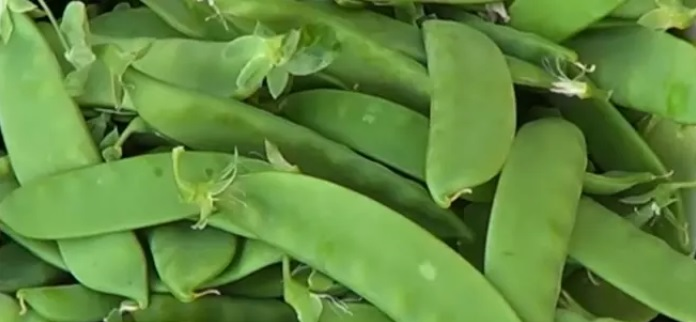
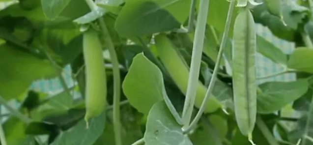

## What are Green peas?

Peas are one of the most overlooked sources of plant-based protein. They are rich in fiber and numerous other important nutrients. Green peas are tiny, yet so delicious and widely popular.

A pea is a most commonly green, occasionally golden yellow, or infrequently purple pod-shaped vegetable, widely grown as a cool season vegetable crop. The seeds may be planted as soon as the soil temperature reaches 10 degree Celsius, the plants grown best at temperatures of 13 -18 degree Celsius.

The modern-day green pea is thought to have originated from the field pea that was native to Central Asia and the Middle East. Because its cultivation dates back thousands and thousands of years, the green pea is widely recognized as one of the first food crops to be cultivated by humans. Peas were consumed in dry form throughout much of their early history and did not become widely popular as a fresh food until changes in cultivation techniques that took place in Europe in the 16th Century.

## Green Peas Are Grown World Wide

Green Peas are now grown throughout the world in every climatic zone and are widely consumed in both fresh and dried form. While growing approx. 3 million tons of peas per year, Canada is currently the largest world producer and exporter of peas. France, China, Russia and India are also large-scale producer of peas, India is also the world’s largest importer of this food due to its great popularity in that country.

They have been part of the human diet for hundreds of years and are consumed all over the world. They are most often consumed as a starchy vegetable.

## Nutritional Profile of Green Peas

A lot of facts and finding may vary depending upon habitats & age of the subjects (green peas). Like fresh green peas and frozen peas may look the same but they may taste slightly different and nutrient values may also vary.

### Vitamins in Green Peas
Vitamin A, C, D, E (Alpha Tocopherol), K, Thiamin, Riboflavin, Niacin, B6, B12, Folate, pantothenic Acid, Choline and Betaine

### Carbohydrates in Green Peas
- Dietary Fiber
- Sugar
- and zero starch

### Fats & Fatty Acids
- Saturated Fat
- Monounsaturated Fat
- Polyunsaturated Fat
- Omega-3 Fatty acids
- Omega-6 fatty acids

### Calories from Green Peas:
Green peas gets calories from carbohydrate, fat and protein that are found in green peas.

### Proteins and Amino Acids in Green Peas
- Tryptophan
- Threonine
- Isoleucine 
- Leucine 
- Lysine 
- Methionine 
- Cystine 
- Phenylalanine 
- Tyrosine 
- Valine 
- Arginine 
- Histidine
- Alanine 
- Aspartic acid 
- Glutamic acid 
- Glycine 
- Proline 
- Serine

## There are two types of Green Peas

### Snow Peas

Snow peas are also known as Chinese pea pods since they often used in stir-fries. They are flat with very small peas inside; the whole pod is edible, although the tough “strings” along the edges are usually removed before eating. Snow peas can be grown in open fields during cool seasons and can thus be cultivated during winter and spring seasons.

The stems and leaves of the immature plant are used as a vegetable in Chinese cooking, stir-fried with garlic and sometimes combined with crab or other shellfish. It contains about 60 calories and 10.5 grams of carbohydrate in one cup serving. It also contains about 3 grams of fiber for one cup serving.

## Field Peas

Field pea seed is a rich source of protein, carbohydrate and some minerals, although new nutritional content of the seed varies with the environment and genetic factors. Field peas also serve as excellent stock feed. It is a cool season crop grown in many parts of the world. Planting can take place from winter to early summer depending on location.

The average pea weighs between 0.1 and 0.36 gram. The immature peas are used as a vegetable, fresh frozen or canned. In modern times peas are usually boiled or steamed, which breaks down the cell walls and makes the taste sweeter and the nutrients more bio available. It is an important part of diet of the people.

## Green Peas Health Benefits

Green peas have many essential vitamins and minerals that the body requires. Peas are a good source of dietary fiber, Vitamin A, Iron Folate, Vitamin C and manganese .

- Eating green peas regularly may reduce the risk of cancer, mostly due to peas antioxidant content and their ability to reduce inflammation in the body. Furthermore, they are rich in several nutrients known for their ability to lower the risk of cancer, including vitamin K which may be especially helpful for reducing the risk of prostate cancer.

- One of the health benefits of green peas is blood sugar control. First of all they have a relatively low glycaemic index, which is a measure of how quickly your blood sugar rises after eating a food Diets that contain a lot of low GI foods have been shown to be helpful for regulating blood sugar levels.

- Eating green peas may improve digestion because they contain a large amount of fiber. First off all, fiber feeds the good bacteria in your intestines, which keeps them healthy and prevents unhealthy bacteria from overpopulating.

- The niacin in peas helps reduce, the production of triglycerides and very low-density protein, which results in less bad cholesterol, and lower triglycerides.

## Calories In Green Peas

Green peas are an easy to find legume that can boost nutrition in many of your favourite foods. It contains large Number of calories if you consume 100 gm of peas seeds it gives you approx 80 calories. Fresh shelling peas are most readily available both canned and frozen because they lose flavor rapidly after being harvested.

## Protein in Green Peas

It is unique from other beans because of its high protein content. It is a rich source of Protein after consuming a cup of pea seeds, we can get a full day protein diet. Eating adequate amounts of protein and fibre may automatically reduce the number of calories you eat throughout the day by keeping your appetite under control.

**100gm peas seed = 5gm Protein **

Green peas are one of the best plant-based sources of protein, which is a major reason why they are so filling, along with their high amount of fiber. Eating protein increases the levels of certain hormones in your body that reduce appetite protein works together with fiber, to slow digestion and promote feelings of fullness.

## Side-effects of Green Peas

- Like other legumes, green peas have been reported to cause bloating, an uncomfortable swelling of the stomach often accompanied by gas and flatulence. They are a group of crabs that escape digestion and are then fermented by the bacteria in your gut, which produce gas as a by-product. 

- It is harmful and should be avoided due to the anti nutrients they contain. It may disrupt the absorption of some nutrients and abuse digestive symptoms.

- However, there are several things you can do to help prevent these effects. These include trying certain preparation methods and watching your portion size.

### FAQs

### What are benefits of green peas?
Green peas are rich source of protein and fiber and lack amino acids, you are advised to pair green peas with other source of mineral, vitamin and protein to make up nutritional deficit.

Eating green peas will help promote muscle strength, bone, nail & teeth health, green peas also maintain weight and helps in weight loss.

### Are green peas a good source of protein?
Yes, green peas are an excellence and best plant based source of protein also high source of dietary fiber. Eating protein and fiber rich green peas keeps appetite under control and reduces calories.

### Are green peas bad for you?
No, green peas are not bad at all, people have been eating green peas for centuries all over the world. Green Peas are rich source of protein and dietary fiber but they lack amino acids this is why you are advised to pair green peas with other nutrient rich source to fill the deficit.

### Are frozen peas good for you?
Frozen green peas are not as good as fresh green peas because frozen loses its nutrients up to some extent. I would always buy fresh green peas during its season and if I want to eat green peas during off-season then I would buy frozen green peas.

