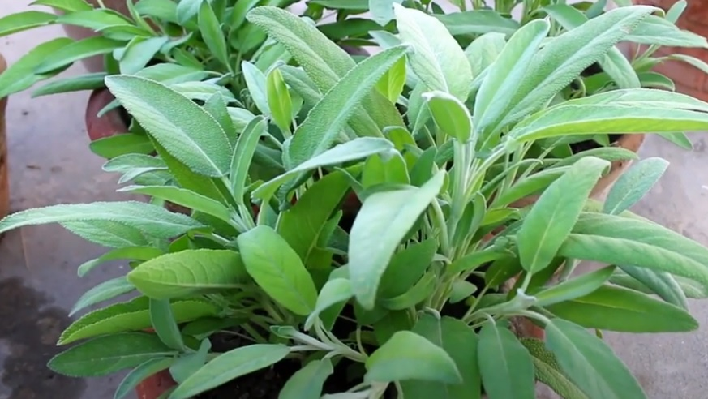
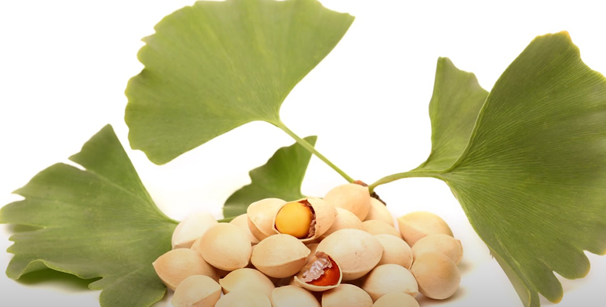

At this contemporary era the most fatal mental flaw is hovering over 50 million in the world today. According to the latest report the developing nations are afflicted with this lethal disease as the   fastest growth in the elderly population is taking place in China, India, and their South Asian and Western Pacific Neighbors. Prevalence of the Dementia diseased 31.3% in France, 33.7% in Australia ,45.8% in Italy, 55.7% in United Kingdom, 56.5 in Canada etc.

## What is Dementia?
According to the medical or science phenomena Dementia is an umbrella of an assembled disorder (chronic decline in cognitive functions due to the damage of the tissues, cells or any of the four lobs in the brain) of the various important parts of the brain (Due to the global warming, contemporary life styles, the widely spread diseases Diabetes, Obesity, Nuclear family, loneliness) the old generations of 65 and above are suffering from this virulent mental flaw.

### Types of Dementia
`youtube: https://youtu.be/lGz22A8tUMk`

### ANGUISHES ARE SPREADING AS FIRE AS THROUGH DEMENTIA

- Belly up of the thinking, recalling, perception, come to the light.

- Even intoxicating daily life, unable to recognize people and self-care.

## PREVENTION IS BETTER THAN CURE
Medical Science is not able to give assurance to cure Dementia but the best creations of the creator, the human can take precautions to live lively at least.

The Dementia patients may not get rid of this fatal disease but can elongate life span with normal style, without any side-effects or further deterioration in the plight.

In a Nut Shell the following Herbal medicines lead the Patients to the path of the light without pushing towards worse, the lay of the land.

## TURMERIC

We can see the glimpses of this bright color spice or Indian golden spice 5000 years ago. It has been in use as a medicinal herb since then. The percentage of the Dementia patients is negligible in India comparatively than England and other countries as Indian people take Turmeric as the spice. Turmeric has active bright color constituent CURCUMIN.

### MOLECULAR FORMULAE
BOTANICAL NAME: Curcuma longa.

It has potential role in the prevention and treatment of Dementia. Curcumin improves the cognitive functions of the bumfuzzled brain being an antioxidant, inflammatory and lipophilic actions. It decreases Beta amyloid plaques, delayed degradation of Neurons, Metal chelation, decrease microglia formation and finally memory skill improves.

### HOW MUCH SHOULD BE TAKEN IN A DAY
About 500 milligram curcumin in a day. (a table spoon of fresh turmeric contains 200 milligram curcumin approximately)

### Turmeric Nutritional Facts
- Turmeric has anti-inflammatory (pain killer) carminative, anti flatulent, antimicrobial properties.
- It contains essentials oils for health such as turmerone, zingiberene, cineole and p-cymene.
- One table spoon of Turmeric powder contains 29 calories, 0.91 grams of protein, 0.31grams of fat, 6.31 gram of carbohydrate, 2.1 gram of fiber, 0.3 gram of sugar. Copper, Zinc, Magnesium

This one table spoon of turmeric supplies 26 percent of daily manganese needs, 16 percent of daily Iron, 5 percent of daily potassium, 3 percent of daily vitamin c. Vitamin B-6, Vitamin E, Cholesterol.

## SAGE

BOTANICAL NAME: Salvia Officinalis

It is a spice known for its pungent scent. It contains compounds that protects brain from deteriorating further and boost memory skills.

### Sage Nutritional Facts
One teaspoon (0.7) grams of ground sage contains2 calories, Protein 0.1 gram, Carbs 0.4 grams, Fat 0.1 grams, vitamin k 10 of daily intake, 1.1% of Iron, Vitamin B-6 1.1%, Calcium 1%, Manganese 1%, and various acids.

### HOW MUCH SHOULD BE TAKEN SAGE IN A DAY
Two cups of tea form twice a day

## GINKGO BILOBA

It is one of the oldest living tree species, approximately 300 million years ago. It improves cognitive functions in part by stimulating circulation and promoting blood flow to the brain. This herb has an extract EGb761 is very useful in slowing decline in cognition among the Dementia patients.

### GINKGO BILOBA NUTRITIONAL FACTS
It contains an abundance of useful compounds including antioxidant, vitamin c, and carotenoids. Ginko extracts effectively increases blood circulation and increase oxygen levels in the brain tissues. It acts to dilate the segments of the circulatory system, micro-capillaries which has widespread affect on the brain.