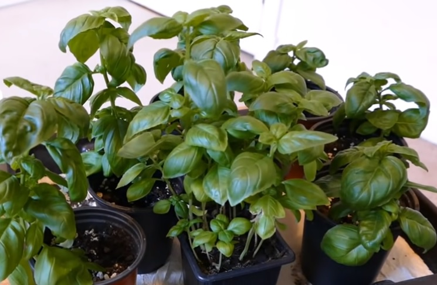
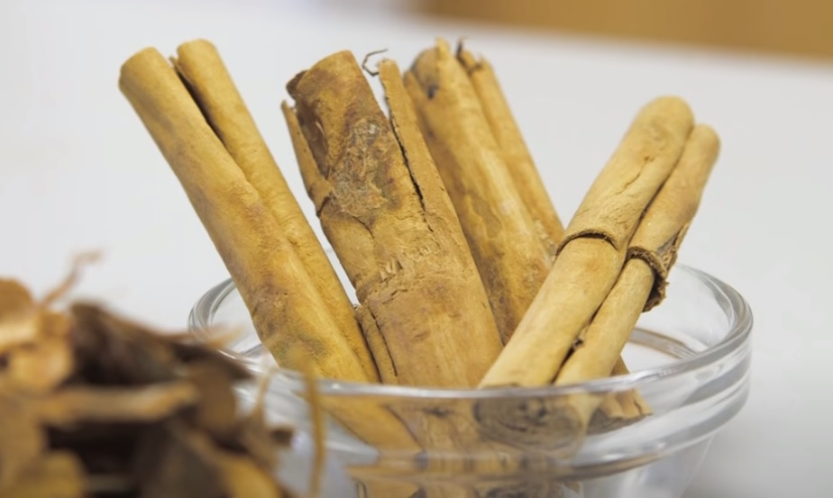
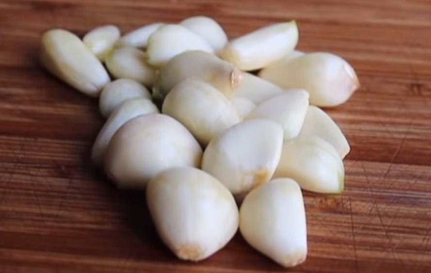
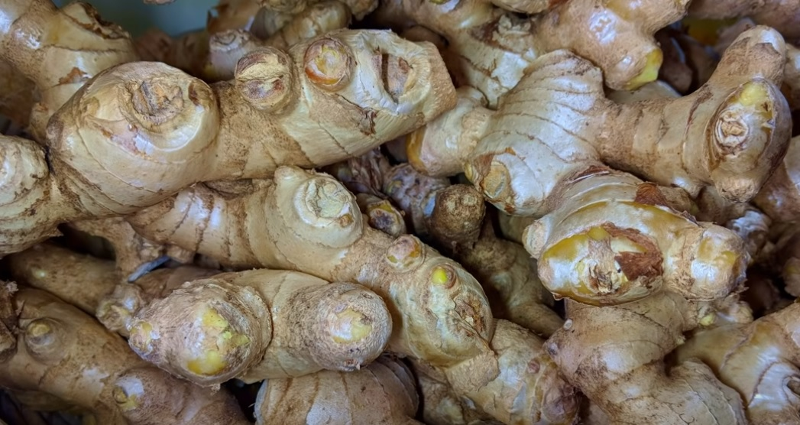

Many of us are dealing with hypertension, which is also known as high blood pressure. Therefore, experts are recommending to treat the condition with lifestyle changes and some home remedies. Herbal remedies are one of the most commonly used home remedies as they are natural, friendly, non-toxic, and very useful.

When you are planning to start an herbal medicine, you need to talk to your doctor first, especially when you are using other medications. This is because some herbs, when taken in large quantities, may produce undesirable side effects or interfere with other medicines.
 
Here is a list of best herbs for lowering blood pressure

## Basil for lowering blood pressure

Basil is an herb that we regularly used in our food. It has the potentiality to reduce your blood pressure. Basil extract shows a significant effect, although it is only briefly. The best way is to add fresh basil to your diet as it is easy and will not hurt you certainly. It is better if you can grow your herbs in your kitchen garden, as you can get the fresh leaves for your pasta, soup, salads, and other dishes.

## Cinnamon for lowering blood pressure

Cinnamon is a tasty herb used for seasoning in our regular food. It has the potentiality to bring down your blood pressure numbers. A study in rodents proved that cinnamon extract lowered both sudden onset and prolonged high blood pressure. Though the extract was given intravenously. It shows potentiality even when consumed orally. You can sprinkle cinnamon powder on your serial oatmeal ok input into your coffee. The flavor enhances your curries, fries, soups, and many more dishes.

## Garlic for lowering blood pressure

Garlic can lower your blood pressure by increasing a substance in your body known as nitric oxide. Nitric oxide is responsible for relaxing your blood vessels and dilating them and thus lowers your blood pressure, by letting your blood flow more freely. This has a pungent flavor in raw form. So, you can add it to your favorite recipes. You can fry them first if you still feel the flavor is intense. There are many garlic supplements available in the market nowadays, and you can use them if you even can’t manage the smell.

## Ginger for lowering blood pressure

Ginger is a very commonly used herb for conditions like cold, cough, indigestion, etc. and it is also used in our regular food. It has the potential to lower blood pressure by improving blood circulation and relaxing the muscles surrounding blood vessels. The study of its properties on human beings is conclusive, but it is most widely used in food for its refreshing taste and herbal properties.

## Flaxseed for lowering blood pressure

According to studies, Omega 3 fatty acids present in flax seeds are responsible for reducing your blood pressure. Consumption of flax seed regularly for more than 12 weeks, gives you the best benefits. They also protect against cardiovascular diseases by lowering serum cholesterol and improving glucose tolerance, thus acting as an antioxidant. Though you can buy many products that contain flax seeds, it is better to buy whole or ground flax seeds and add them to your food. Flax seeds can be eaten in virtually any dish, and this is the best part about it.

