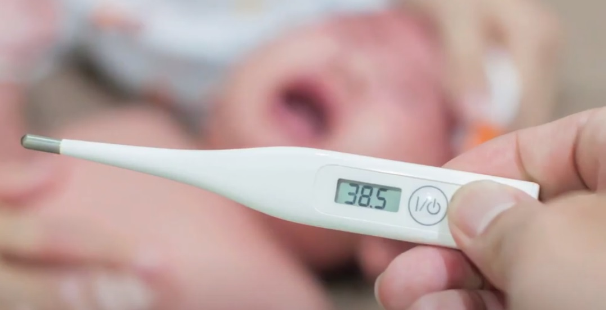
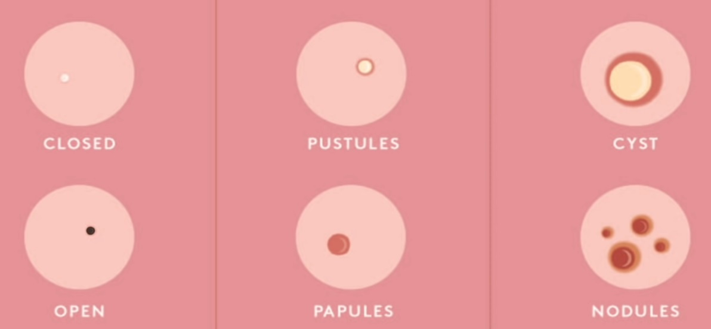
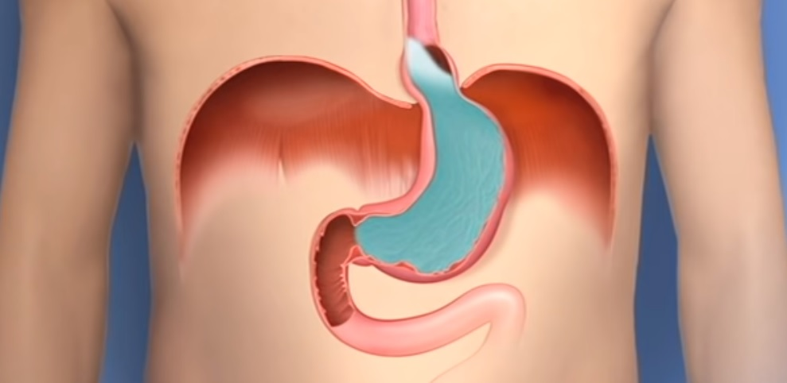
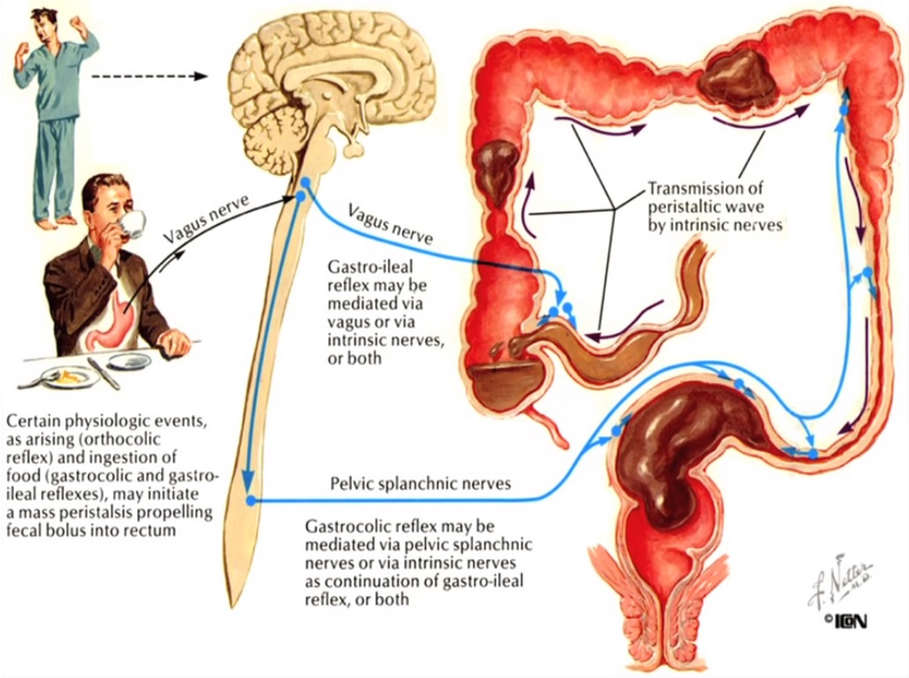
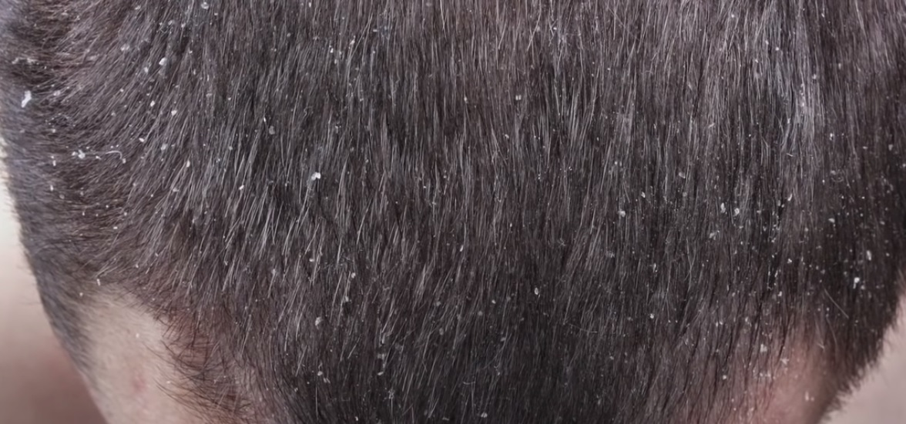
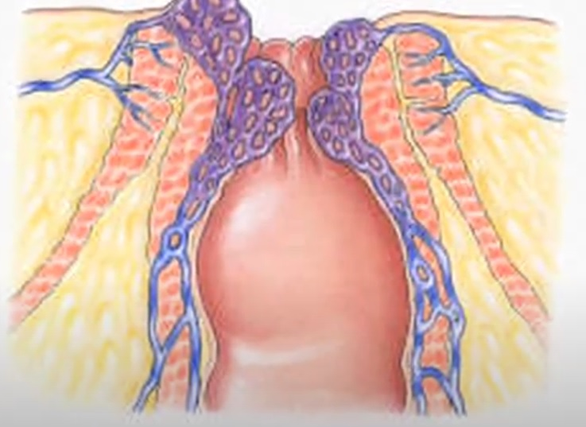

Modern science is indeed a boon to the human life. But did you know that there are other ways which are more effective in treating our disease concerns around the globe? They are called home remedies. Yes, you heard it right! Home remedies are certainly more effective when it comes to treating certain seasonal and common diseases. Furthermore, they do not show side effects when taken in the right manner.

Home remedies have been used since the early ages and they have showed effective results as well. For this reason, many people prefer to go for home remedies over the modern medical treatment. However, these are preferred only in cases of mildly disturbing health issues and not the major ones. So getting to know such home remedies is of course necessary.

## How home remedies are better than other treatments?

- Home remedies have been used for centuries which makes them a trust-worthy solution.
- Though a particular home remedy does not seem to show effect, it definitely will not cause harm.
- Home remedies are mostly natural so they do more good to your skin and body without any doubt.

Here are some of the most useful home remedies you should definitely be aware of, and try when need be.

## Home remedy for cold

Ginger is a popular home remedy for cold as you can easily find it in your kitchen. It is used in Ayurveda as a home remedy for cold, cough and sore throat.

Drinking a warm cup of ginger tea is considered an effective home remedy for cold. But be sure to not take it in excess as it leads to heartburn and indigestion.

**Warning:**

People with gallstones or bleeding disorders better consult a doctor before taking ginger.

## Home remedy for fever

Basil is a well known herb when it comes to Ayurvedic treatment. Basil is simply Indian Tulsi (basil) which is easily available everywhere to use as a home remedy for fever. It has healing properties which are effective in bringing down fever.

Add 20 leaves of basil to water in a pan and give it a boil at medium fire. Now strain the water and add a teaspoon of crushed ginger to it. Boil it until only half of the solution is left and add a little honey. Drink this thrice a day for three day to get relief. This serves as an effective home remedy for fever.

## Home remedy for pimples

Lemon acts as an effective agent for getting rid of pimples as lemon contains Vitamin C. It is an antioxidant and a natural astringent, therefore aids in giving a pimple free skin. These make it an important home remedy for pimples.

To try out the home remedy for pimples, take a cotton ball and soak it in freshly squeezed lemon juice. Now wipe it across your pimples and leave it overnight. Wash your face in the morning with cold water and repeat until your pimples disappear.

## Home remedy for headache

Essential oils have by far shown the best results in treating all kinds of headaches. They have anti inflammatory and anti pain properties which desensitize the pain fibres. This makes them a productive home remedy for headache.

Lavender, rosemary and peppermint oils are the ones you should opt as a home remedy for headache. Give your forehead and temples a little massage with these oils or use them for a cold compress. This home remedy for headache is the one you should definitely try.

## Home remedy for acidity

Acidity has become one of the most common problems these days due to the poor quality of the food. For this reason, you should know at least one home remedy for acidity. Prefer to eat only home made food every day to avoid acidity and gastric problems.

A good home remedy for acidity would be to drink mint infused water. Boil a few mint leaves in water, strain them and drink of glass of it after every meal.

## Home remedy for constipation

Constipation is a common problem and there might be many reasons behind it. Most of us face it in our day-to-day life so a home remedy for constipation is always helpful.

One good home remedy for constipation is coffee. Coffee contains caffeine which causes an urge to poop in most people. So the next time you feel constipated, drink a cup of coffee.

## Home remedy for dandruff

Dandruff can be quite embarrassing so treating it quickly is very much essential. Instead of investing a lot on specific products, you can try out a simple home remedy for dandruff.

Tea tree oil is a powerful and natural home remedy for dandruff. Mix 6 drops of tea tree oil with any essential oil, preferably lavender oil.  Massage this onto your entire scalp, leave it for 30 minutes and shampoo your hair.

## Home remedy for piles

Piles can occur due to lack of enough water intake or eating a lot of processed food. A potent home remedy for piles can ease the inflammation and give relief.

Castor oil has a wide range of properties like anti-inflammatory, anti-fungal, anti-bacterial etc. So it can serve as an excellent home remedy piles. Just mix 3 ml of castor oil to your glass of milk and drink it before going to bed every night.

## Home remedy for dry hair

Dry hair has become a common issue these days due to its exposure to sunlight and pollution. Do not skip out on oiling your hair. Oiling is a necessary step that serves as home remedy for dry hair.

A banana and honey hair mask is also a great home remedy for dry hair. It can smoothen your hair instantly after a single wash. Just mix two tablespoons of honey with two bananas and apply as a mask. Wait for 30 mins and wash off your hair.

### Conclusion

In my opinion, home remedies should be tried out by everyone as they are safe and natural. If they do not show effective results, you can always consult a doctor for further treatment. In case you face minor issues, you can totally rely on home remedies. These are simple and can show instant results in most cases.