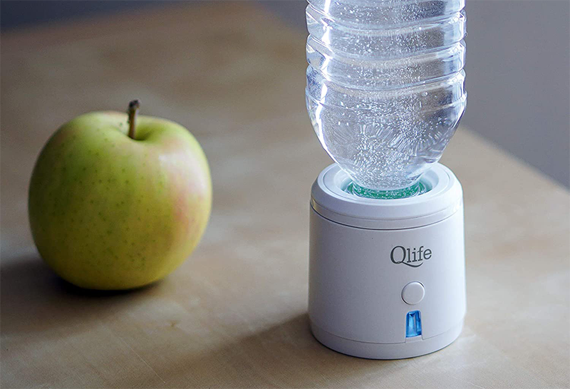

If you are wondering how Hydrogenated water is healthier than packaged and mineral water then this post will clarify things for you in details.

Firstly, Hydrogen is an odorless, tasteless, and colorless gas. Hydrogen water is pure water with extra hydrogen molecules added to it.

In a normal condition, there is one hydrogen as well as one oxygen atom. However, in the case of hydrogenated water, there is additional hydrogen that provides benefits that may not have been delivered otherwise.

Hydrogen, being the most abundant molecule present in the world, it's such a benefit that everyone can exploit. Following are some of the health benefits of drinking hydrogenated water:

## Reduce fatigue & boost vitality

Adenosine Triphosphate (ATP) is like a fuel that kickstarts your cells in cases of physical activity. Time and again, research have proved that hydrogen increases the Adenosine triphosphate levels. Eventually, this leads to better performance in an individual and most importantly, there’s barely any fatigue to go through.

## Remedy for allergies

The hydrogen molecules contained in the ionized alkaline water are microscopic. Meaning, they are enough to cross the blood barrier, and eventually, they can hydrate every cell from within. This process helps in keeping the histamine production to a minimum. Though there are medications and prescriptions available in the market to cure allergies, the majority of the people are turning to a natural way of healing this instead of stuffing one with countless medicines.

View [Hydrogenated Water Genefator](https://amzn.to/3hDxIIG) at amazon

## Promote cardiovascular cerebrovascular health

When you exercise regularly, you may experience fatigue or decreased endurance. Well, this usually happens due to the rise in lactic acid in one's body. However, on the contrary, hydrogen declines the production of lactic acid. Yes, you heard that right! Thereby, hydrogen, promotes cardiovascular health and one's overall well-being.

## Antioxidant

There are various antioxidants available in the market, however, very few have been successful in the therapeutic trials. It is strongly believed that hydrogen acts as an antioxidant. The most astonishing fact about hydrogen is that it selectively goes only after the bad radicals. Unlike other antioxidants, which completely neutralize them, hydrogen is unique in this sense. However, a recent study by the National Institute of Health, conducted on 26 people has validated that more research is necessary to support this theory.

## Improving Metabolism

Researchers also discovered an increase in a hepatic hormone called fibroblast growth factor. The main function of this hormone is to improve the glucose and fatty acid. Eventually, this hormone stimulates energy metabolism with an increased oxygen consumption. You would be surprised to know that drinking hydrogen water and weight loss are pretty much associated with each other.

## Anti-inflammation

Various research and studies have shown that hydrogen has the potential to alter cell signaling and gene expression. This pretty much explains why hydrogenated water is anti-inflammatory and the ultimate remedy for allergies.

## Prevent Degenerative Diseases

Degenerative diseases are those diseases wherein there's a loss of function in the organs or the tissues. For example, lupus, arthritis, dermatitis, Parkinson's disease, etc., all have one thing in common. They are all caused due to high levels of oxidative stress, damaging their cells and DNA. Hydrogen, being the tiniest size can efficiently scavenge free radicals and promote overall health.

## Anti-Aging

Chronic oxidative stress has been identified as one of the major factors in an individual's aging process. Our modern lifestyles and the constant race of achieving something has been the root cause of all this. Amid all this, researchers have confirmed hydrogen to be that secret agent that helps minimize the fine lines and even improves the appearance of deeper ones. The same promise that high-end creams and lotions made to us have failed to deliver for decades.

## Slimming Beauty

A recent study was performed on mineral water in comparison to water containing molecular hydrogen. The results revealed that bathing in hydrogen water declined the oxidation-reduction potential (ORP) of the human skin. Not only this, but it also improves elasticity. After various experiments, it was also proved that the properties were beneficial to treat a sunburn too.

## Improve memory & cognitive function

Our brain merely weighs 2-3% of our body weight but consumes about 20% of the oxygen. Later the oxygen you inhale converts it into free radicals. The hydrogen neutralizes these extra radicals and eventually helps in enhancing our cognitive functions and memory. There are a number of experiments and demonstrations conducted to validate this theory.

Truly, hydrogen has some of the most fascinating and multidimensional approaches. These are some of the valuable benefits that we are aware of. However, there is further research and study in progress to dive deeper into this topic.

Believe it or not, but the molecular hydrogen seems to be like the treasure of perfect therapeutic that the world has been searching for. Now that you are aware of them, make sure your friends and family are familiar with it.