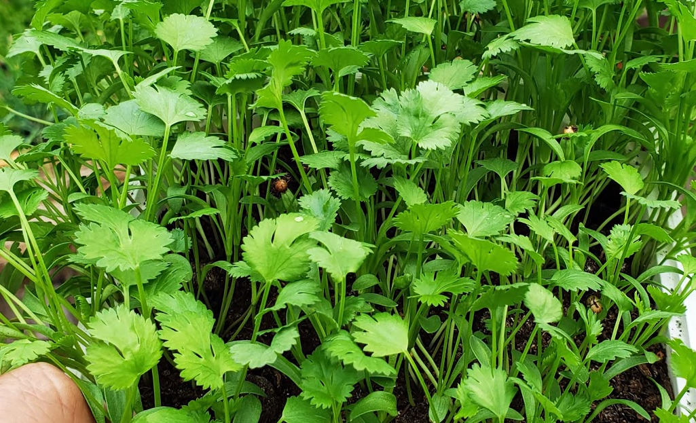
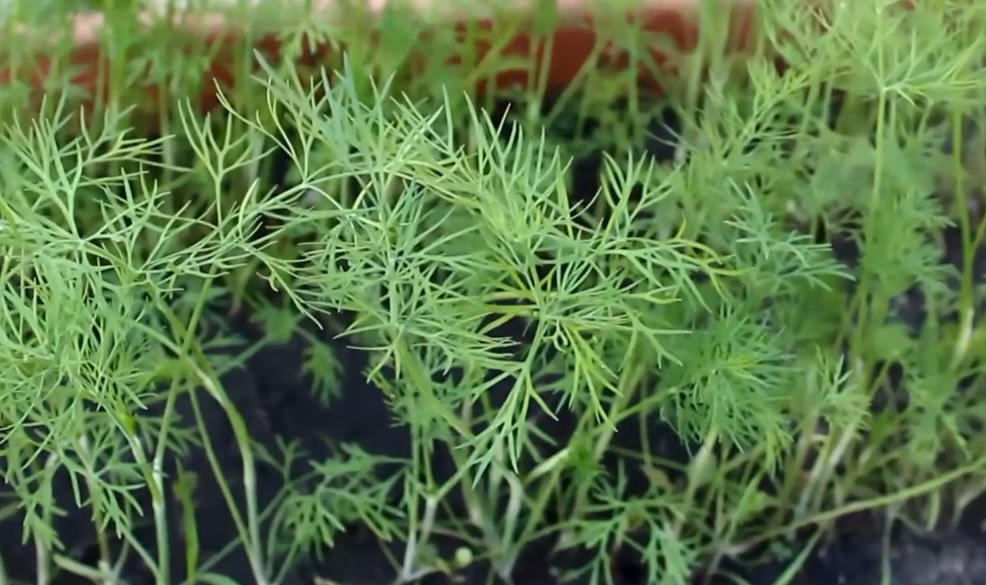
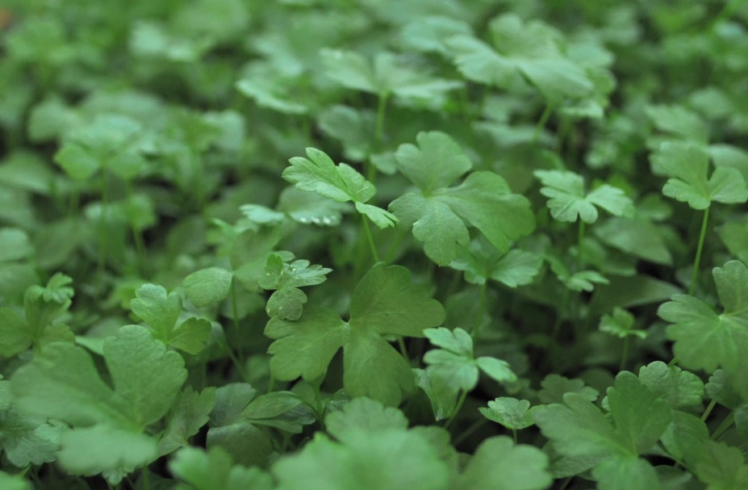
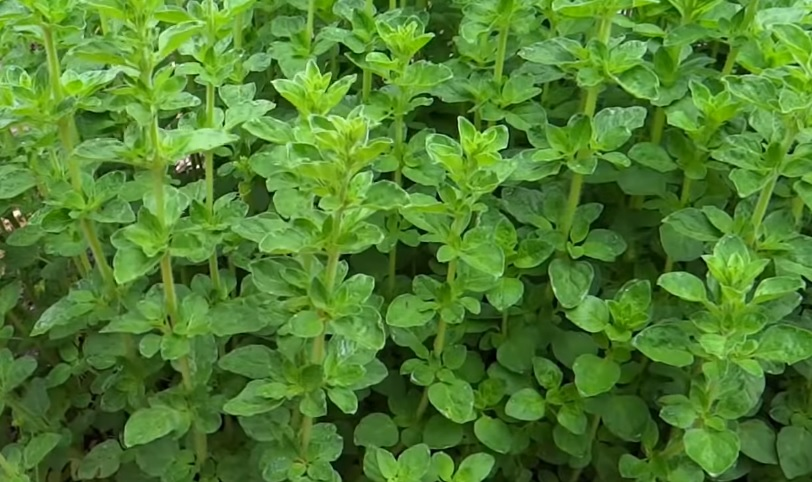
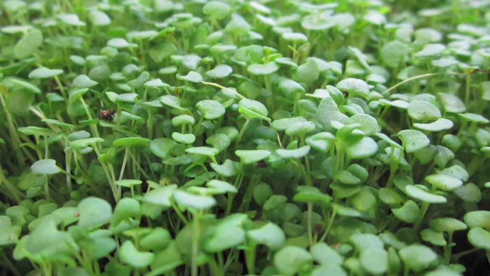
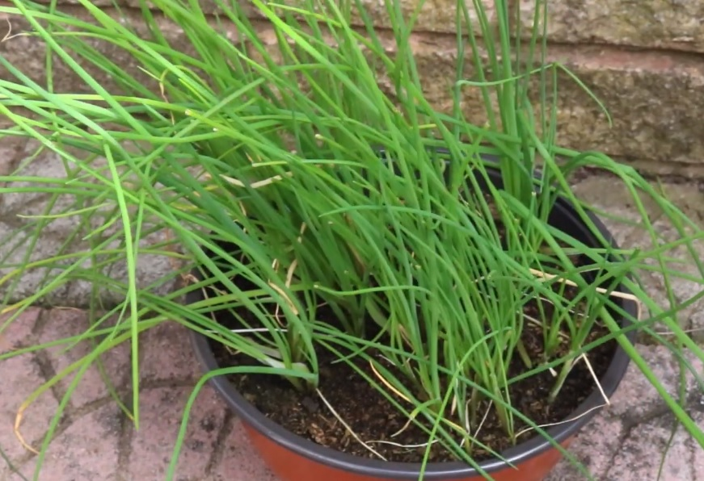
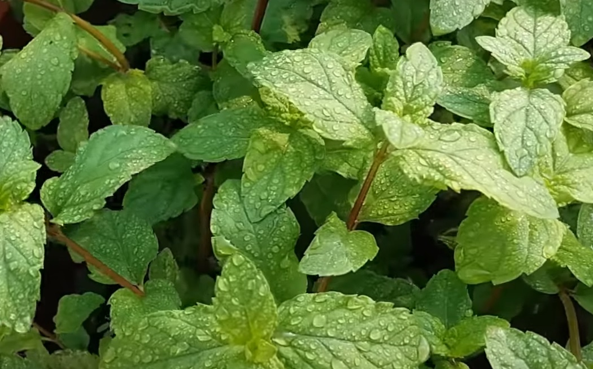
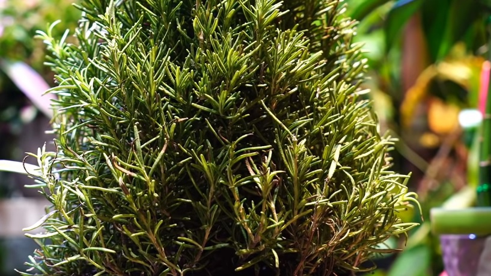

Culinary herbs that you can grow indoor - the list of culinary herbs that are used everyday in our kitchen and local restaurants. These herbs are comman herbs that most of us like to add favorate dishes.

## Basil

For a healthy Basil plant, sow its seeds in soil almost ¼ inch below. Basil needs moist soil and weeds are not favourable for them.  Make sure it gets 6 to 8 hours of sunlight daily. The D-shaped basil leaves take minimum 7 days to show up.

## Cilantro

Cilantro needs well-drained moist soil with full sun for nice fresh green leaves. The seeds should be planted with 6 to 8 inch gap between them and ¼ inch below the soil. Cilantro leaves can be harvested in 3 to 4 weeks after sowing. And the seeds could be harvested in almost 45 days.

## Dill

Dill seeds need to be sown ¼ inch deep and 18 inches apart in soil. The soil has to be warm and rich.  Dill plants are visible in next 10 to 14 days after sowing and could be harvested as soon as there are around 5 leaves on it. For best results start with fresh dill seeds in early summer and leave the soil undisturbed throughout the season for more plants the next season.

## Parsley

This slow germinating herb needs 6 weeks to grow fully from its seeds. Parsley seeds do not need to be buried inside the soil because they are very small. Nutrient rich well-drained soil is needed for its proper growth along with occasional weeding and watering. They are well when potted 1 or 2 per pot.

## Oregano

Put oregano seeds in soil and cover them with plastic after spraying some water on it. A sunny location such as window is favourable for the growth of oregano plants. It takes almost a week to germinate. Once they are 6 inch tall, thin them a foot apart. Oregano requires watering only during dry weathers.

## Thyme

Plant thyme seeds 4 to 6 inch apart in the beginning of the spring. Sprinkle a little bit of soil over the tiny seeds of thyme and water them thoroughly. Then cover it with plastic and keep warm. Wait till 12 weeks to use it in your kitchen.

## Chives

Chives need at least 4 hours of sun and well drained soil. Plant the Chive seeds 8 to 10 inches apart and ¼ inch deep. Take care of weeds and move them to light after they sprout. Cut it half and use once a foot tall.

## Peppermint

For good peppermint plants moist the soil and put the seeds ¼ inch deep. Cover with plastic and keep it in any indoor sunny place. Uncover it after you see the mint sprouts in 7 to 14 days.

## Rosemary

Due to low germination always plant more rosemary seeds. Cover the rosemary seeds barely with rich soil and water it less. Sow the seeds 3 months before the warm season. That leaves ample amount of time for the rosemary seeds to germinate.  Therefore, growing rosemary from cuttings is much favourable than planting seeds.