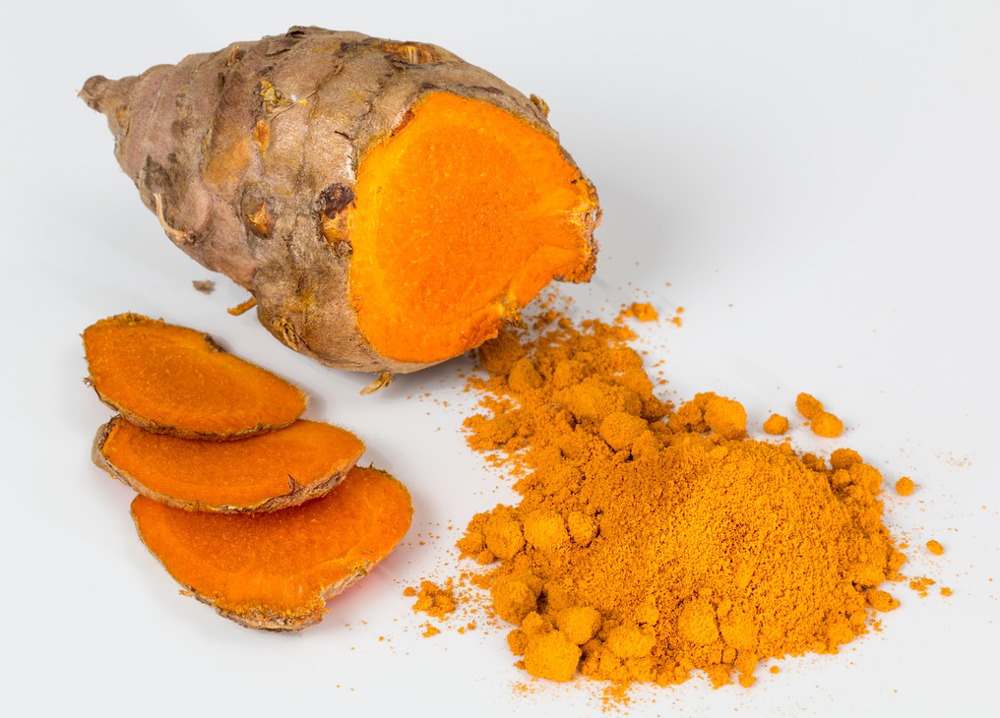

## What is turmeric?
Turmeric is a yellow color spice. In market, turmeric is available in form of powder and turmeric supplements in form of capsules. This is extracted from Rhizome called Curcuma longa, belongs to family – Zingiberaceae. The roots are used for cooking. Plants are gathered each year for their rhizomes, some for propagation in the following season and some for consumption. These are perennial, rhizomatous and herbaceous plants. The rhizomes are used fresh or boiled in water and sun dried, after which they are ground into a deep orange-yellow powder commonly used in coloring and as a flavoring agent in many Asian cuisines, especially for curries, as well as for dyeing. Turmeric powder has a warm, bitter, black pepper-like flavor and earthy, mustard-like aroma. It has many benefits, it can used for many purposes. It also has few side effects.

Turmeric is a flowering plant. It is commonly used as spice. It is one of the main spice in Indian, Pakistani, Bangladeshi, Nepali cuisine. It gives yellow color to food. Curcumin is the main active ingredient present in turmeric. It has very strong anti-oxidant. Turmeric also has anti-inflammatory substance. Because inflammation is one of the causes of arthritis symptoms, turmeric may help people with arthritis pain and stiffness. These plant are perennial, herbaceous and rhizomatous. The rhizomes are boiled in water and dried, after which are ground into deep orange yellow powder commonly used as a coloring and flavoring agent, especially for curries and dyestuffs. It is used in many products such as canned beverages, baked products, dairy products, ice cream, yogurt, yellow cakes, orange juice, biscuits, popcorn color, cereals, sauces, and gelatin.

## Types of Turmeric

The variety of turmeric are many, here are some types of turmeric that can be found easily in the market.

### Whole Turmeric
Curcuma aromatica which is known for fine odor. This color turmeric is close to cooking turmeric. It is widely used as natural cosmetics to apply on skin. It has bitter taste so it is avoided for cooking.

Curcumin longa which is prepared by boiling the whole roots in water, sun dried and then powder is prepared. This turmeric powder is used for cooking purposes.

Black turmeric is rare variety and roots are slightly black in color. These are used for medicinal purposes.
Tree manjal, this is a kind of vine and generally used for medical preparations.

### Raw Turmeric
This is pure and unprocessed turmeric. This type is with more benefits, with raw turmeric none of the Curcumin, the most powerful ingredient is lost during processing. It is great to use raw turmeric if it’s available, to do so, grate the raw turmeric over your food or slice and dice into small pieces.

### Paste Turmeric
The paste is used in turmeric milk, smoothies, curries, and for application on skin. This turmeric paste can be kept it in a jar in the fridge to use in various recipes. The paste is prepared by adding little amount of water to the turmeric powder and mix it well. Now you are done with the paste. 

### Turmeric Powder
To grind whole turmeric into powder, the whole turmeric is boiled, sun dried and them ground. Turmeric powder is easily available in market, and primarily used as a spice in cooking in the Asian countries like India, Pakistan, Bangladesh, and Nepal.

### Turmeric Supplements
Turmeric and especially its most active compound Curcumin have many scientifically-proven health benefits, such as the potential to prevent heart disease, Alzheimer’s and cancer. Turmeric is safe for most people when consumed in amounts found in food. But turmeric can have side effects when taken in large doses. Turmeric contains more than 300 naturally occurring components including beta-carotene, ascorbic acid (vitamin C), calcium, flavonoids, fiber, iron, niacin, potassium, zinc and other nutrients. So the supplements are taken for nutrients and to stay healthier.

## How to Use Turmeric
We can use turmeric for many purposes, some of its uses are listed below:

We can use it as coloring agent in food
We can widely use as natural cosmetics to apply on skin
It also has very strong anti-inflammatory effects so we can apply it on wounds.

 
We can make turmeric tea with lemon to detox our body
It is use to promotes ovulation in women, is great for the skin, and is antibacterial, antifungal, and antimicrobial.

It’s also a blood thinner and blood detoxifier, and will aid in eliminating worms or parasites.
It is also used for headaches, bronchitis, colds, lung infections, fibromyalgia, leprosy, fever, menstrual problems, itchy skin, recovery after surgery, and cancers

In food and manufacturing, the essential oil of turmeric is used in perfumes, and its resin is used as a flavor and color component in foods.

It is also use to cure sore throats, by taking pinch of turmeric and one teaspoon of honey you can get rid of sore throats as well as coughs.

## Health Benefits of Turmeric
Turmeric supports weight loss: The Curcumin has anti-inflammatory activities which is use to fight weight loss.
Turmeric encourages healthy cholesterol levels It says that Curcumin comparable to prescription drug Lipitor on endothelial dysfunction in reducing in inflammation markers of oxidative stress.

Turmeric maintain normal sugar level. Curcumin stabilizes glucose levels in the blood and also helped with complications related to diabetes.

Turmeric helps to maintain healthy cognitive functions and working memory.
Turmeric reduces symptoms of gas related to occasional indigestion.

Curcumin’s anti-cancer properties may inhibit the growth of tumors and reduce the spread of cancer.
The active ingredient in turmeric is Curcumin, a potent anti-inflammatory that helps maintain healthy inflammation responses. 

## Side Effects of Turmeric
Turmeric side effects are rare, but when turmeric is taken in excessive amount, It may upset stomach, diarrhea. Those people have allergy through Turmeric may lead to allergic reaction.

Some drug interactions for turmeric include medications that slow blood clotting, because turmeric is also known to slow blood clotting. So, be careful while taking turmeric with these types of drugs such as such as aspirin, Plavix, ibuprofen, naproxen, and warfarin. Always check with your healthcare provider before taking turmeric. It may cause iron deficiency. 

Risk of kidney stone may lead in people. Curcumin and other chemicals in turmeric might decrease swelling (inflammation).

Taking turmeric along with some medications that are broken down by the liver can increase the effects and side effects of some medications.

So turmeric should be taken in little amount rather than taking excessive.

